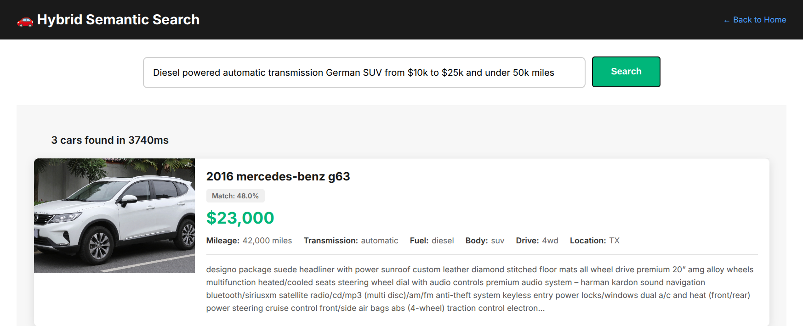

# AI-powered search for PostgreSQL applications

## Overview



Please refer to the code repository [here](https://github.com/orlyandico/car-search-pgvector-bedrock) for the most up-to-date version of this document.

This repository shows how to add AI capabilities to existing PostgreSQL applications without rebuilding infrastructure. Many businesses run systems of record on PostgreSQL with traditional search. This demonstrates adding semantic search and LLM-powered query understanding whilst preserving existing infrastructure, data models, and application code.

**The problem**: You have a PostgreSQL database with 400K vehicle listings. Users search with filters and keywords. You want conversational search ("German automatic convertible between $5k and $7k"). Standard solutions require:

- Dedicated vector database
- Application modifications
- Two separate data stores
- Complex synchronisation logic

**This solution**: Enhance existing PostgreSQL incrementally:
- Keep table structure unchanged
- Add embeddings in separate table with foreign key
- Auto-sync embeddings with triggers + pg_cron + Lambda
- Zero application code changes
- Uses GLM-4.7 for query understanding (cost-effective and MIT-licensed, enabling training data collection for fine-tuning)

**Dataset**: 400K used car listings from Kaggle [Craigslist vehicles dataset](https://www.kaggle.com/datasets/mbaabuharun/craigslist-vehicles) and AI-generated car images

## Scalable pattern: automatic vector embedding synchronisation

This pattern keeps vector embeddings in sync with source data using Aurora PostgreSQL features (triggers, pg_cron, `aws_lambda` extension) combined with serverless compute (Lambda) and foundation models (Amazon Bedrock). The approach provides:

- **Zero application changes**: Embeddings update automatically when data changes
- **Asynchronous processing**: Database writes complete immediately, embeddings generate in background
- **Batch efficiency**: Groups multiple updates into single Bedrock API calls (90% cost reduction)
- **Serverless scaling**: Lambda scales automatically with workload
- **Resilient**: Queue-based approach persisted in database

This pattern applies to any Aurora/RDS PostgreSQL application requiring vector embeddings that stay in sync with changing data.

## Architecture patterns

### Pattern 1: Traditional search with tsvector (baseline)

**What you have:**
```sql
-- Table with tsvector column for full-text search
ALTER TABLE car_listings ADD COLUMN description_tsv tsvector;
CREATE INDEX idx_description_tsv ON car_listings USING GIN(description_tsv);

-- Keyword search
SELECT * FROM car_listings 
WHERE description_tsv @@ plainto_tsquery('english', 'sunroof leather');
```

**Benefits:**
- Built into PostgreSQL, no external services
- Fast with GIN indices
- Handles stemming and stop words
- Cost: Free (pure SQL)

### Pattern 2: Add pgvector for semantic search (new capability)

**What you add:**
```sql
-- New embeddings table (separate from main table)
CREATE TABLE car_embeddings (
    listing_id BIGINT PRIMARY KEY REFERENCES car_listings(id),
    embedding vector(1024),
    updated_at TIMESTAMP DEFAULT NOW()
);

CREATE INDEX idx_embedding ON car_embeddings 
USING hnsw (embedding vector_cosine_ops);
```

**Implementation:**
1. Generate embeddings asynchronously (Lambda + Bedrock)
2. Store in separate table with foreign key
3. Join main table with embeddings for semantic search
4. No LLM needed for query parsing - embed user query directly

**Benefits:**
- Handles synonyms and conceptual queries
- Separate embeddings table keeps main table unchanged
- Can regenerate embeddings without touching source data
- Cost: ~$0.0000012 per query (Cohere Embed v4 only)

### Pattern 3: Hybrid keyword search (LLM + tsvector)

**What you add:**
1. LLM endpoint to parse natural language queries
2. Extract structured filters + keywords from user input
3. Apply filters as WHERE clauses
4. Use tsvector for keyword ranking

**Implementation:**
- LLM extracts filters + keywords
- Apply filters, use keywords for tsvector search
- Cost: ~$0.00104 per query (glm-4.7 + tsvector)

**Benefits:**
- Conversational interface ("German automatic convertible $5k-$7k")
- Works with existing tsvector infrastructure
- No schema changes to main table

### Pattern 4: Hybrid semantic search (LLM + pgvector)

**What you add:**
1. LLM endpoint to parse natural language queries
2. Extract structured filters + semantic query from user input
3. Apply filters as WHERE clauses
4. Use pgvector for semantic ranking

**Implementation:**
- LLM extracts filters + semantic query
- Apply filters, embed semantic query, use pgvector for ranking
- Cost: ~$0.0010412 per query (glm-4.7 + Cohere Embed v4)

**Benefits:**
- Conversational interface with conceptual matching
- Combines structured filtering with semantic discovery
- No schema changes to main table

**Key architectural decision:** Embeddings in separate table allows:
- Independent updates (regenerate embeddings without touching source data)
- Different scaling characteristics (embeddings can be cached/replicated)
- Gradual rollout (add embeddings for subset of records first)
- Incremental updates by adding a trigger on the base table that invokes the Lambda function

Results show similarity scores and all available fields.

## Cost analysis: search approaches at scale

| Search Type | Cost per Query | Daily Cost (10M searches) | Monthly Cost | Notes |
|-------------|----------------|---------------------------|--------------|-------|
| **Traditional Search** | $0 | $0 | $0 | Pure SQL, no AI costs |
| **Semantic Search** | $0.0000012 | $12 | $360 | Cohere Embed v4 only ($0.12 per 1M tokens) |
| **Hybrid Keyword (GLM-4.7)** | $0.00104 | $10,400 | $312,000 | glm-4.7 filter extraction ($0.60/$2.20 per 1M tokens) |
| **Hybrid Keyword (GLM-4.7-Flash)** | $0.00015 | $1,500 | $45,000 | glm-4.7-flash filter extraction ($0.07/$0.40 per 1M tokens) |
| **Hybrid Keyword (Fine-tuned Nova Micro)** | $0.000063 | $630 | $18,902 | Fine-tuned Nova Micro ($0.035/$0.14 per 1M tokens + $1.95/month hosting) |
| **Hybrid Semantic (GLM-4.7)** | $0.0010412 | $10,412 | $312,360 | glm-4.7 + Cohere embeddings |
| **Hybrid Semantic (GLM-4.7-Flash)** | $0.0001512 | $1,512 | $45,360 | glm-4.7-flash + Cohere embeddings |
| **Hybrid Semantic (Fine-tuned Nova Micro)** | $0.0000642 | $642 | $19,262 | Fine-tuned Nova Micro + Cohere embeddings |

**Key insights:**

- **Traditional + tsvector search** remains free (pure SQL, no AI costs)
- **Pure semantic search** (vector similarity only, using Cohere for embeddings) is **867x cheaper** than GLM-4.7 hybrid approaches
- **GLM-4.7-Flash** provides 86% cost reduction vs GLM-4.7 ($45K vs $312K/month)
- **Fine-tuned Nova Micro** provides 58% additional savings vs GLM-4.7-Flash ($18.9K vs $45K/month)
- **Overall savings**: Fine-tuned Nova Micro is 94% cheaper than GLM-4.7 ($18.9K vs $312K/month)
- At 10M searches/day scale:
  - GLM-4.7 hybrid: **$312K/month**
  - GLM-4.7-Flash hybrid: **$45K/month**
  - Fine-tuned Nova Micro hybrid: **$18.9K/month**
  - Pure semantic: **$360/month**

**Cost mitigation strategies:**

1. **Use pure semantic search** for public-facing applications (99.7% cost reduction) but lower quality search results
2. **Use GLM-4.7-Flash** instead of GLM-4.7 for 86% cost reduction ($45K vs $312K/month)
3. **Reserve hybrid searches** for authenticated users or premium tiers
4. **Implement aggressive rate limiting** (10 queries/minute per IP) on hybrid endpoints
5. **Cache LLM responses** (limited effectiveness due to query diversity)
6. **Fine-tune a smaller model** to replace glm-4.7 (see below and Part 2: FINE_TUNING.md)

### The LLM cost problem and fine-tuning solution

At scale, LLM-based filter extraction becomes the dominant cost driver. Consider a hypothetical automotive sales platform that incurs ~10M searches/day:

- **GLM-4.7**: $312K/month ($3.7M/year)
- **GLM-4.7-Flash**: $45K/month ($540K/year) - 86% cheaper
- **Fine-tuned Nova Micro**: $18.9K/month ($227K/year) - 94% cheaper than GLM-4.7, 58% cheaper than GLM-4.7-Flash

**For production deployment:**

- **This is a prototype**: The hybrid search demonstrates the pattern but isn't cost-effective at scale with GLM-4.7
- **Quick win**: Switch to GLM-4.7-Flash for immediate 86% cost reduction
- **Best solution**: Fine-tune Amazon Nova Micro on collected training data (see Part 2: FINE_TUNING.md)
- **Training data**: Automatically logged to `app/training_data.jsonl` with all queries and responses

The training data collection runs automatically - after gathering sufficient examples (1000-10000 queries), you can fine-tune a replacement model that costs $18,902/month instead of $312,000/month (GLM-4.7) or $45,000/month (GLM-4.7-Flash).

**Note on training data**: This implementation logs both user queries and LLM responses for fine-tuning purposes. GLM-4.7's MIT licence permits this usage. When using other models, verify that their terms of service allow using model outputs as training data for derivative models.

## Architecture

- **Infrastructure:** OpenTofu-managed VPC with private subnets
- **Database:** Aurora Serverless v2 PostgreSQL 17.7 (0.5-8 ACU) with pgvector extension
- **Networking:** Private subnets with VPC endpoints (Bedrock, Secrets Manager), NAT Gateway for data loading
- **Embeddings:** Amazon Bedrock Cohere Embed v4 (1024 dimensions, global endpoint)
- **Query understanding:** Amazon Bedrock glm-4.7 for filter extraction
- **Frontend:** Flask application with multiple search interfaces
- **Dataset:** 400K used car listings from Craigslist

## Prerequisites

- OpenTofu >= 1.0
- AWS CLI installed locally with appropriate credentials and default region configured
- Python 3.12+ with pip
- AWS region set (defaults to eu-west-2)

**Note:** The EC2 loader instance is provisioned with AWS CLI (pre-installed on Amazon Linux 2023), boto3, and IAM instance profile for automatic credential management. No manual AWS configuration needed on the instance.

## Reference implementation

This repository provides a complete working implementation of all patterns described above. The implementation uses:

- OpenTofu for infrastructure provisioning
- Aurora Serverless v2 PostgreSQL 17.7 with pgvector extension
- Lambda functions for embedding generation
- Amazon Bedrock (Cohere Embed v4, glm-4.7 4.5)
- Flask web application demonstrating all four search interfaces

See **Appendix A: Detailed Setup** for complete deployment instructions.

## Incremental embedding updates

After initial embedding generation, you can enable automatic embedding updates when car listings are modified using the following pattern.

### Pattern: Asynchronous vector embedding updates (Aurora/RDS PostgreSQL)

This pattern keeps vector embeddings in sync with source data using Aurora PostgreSQL features (triggers, pg_cron, `aws_lambda` extension) combined with serverless compute (Lambda) and foundation models (Amazon Bedrock). The approach provides:

- **Zero application changes**: Embeddings update automatically when data changes
- **Asynchronous processing**: Database writes complete immediately, embeddings generate in background
- **Batch efficiency**: Groups multiple updates into single Bedrock embedding API calls (90% cost reduction)
- **Resilient**: Queue-based approach survives failures and retries automatically

**Key components:**
1. **PostgreSQL trigger**: Captures INSERT/UPDATE events and queues listing IDs
2. **pg_cron**: Scheduled job runs every minute to process queue
3. **Stored function**: Batches up to 96 IDs and invokes Lambda asynchronously via `aws_lambda.invoke()`
4. **Lambda + Bedrock**: Generates embeddings and updates pgvector table
5. **Staging table**: Decouples write operations from embedding generation

**Note:** This pattern requires Aurora PostgreSQL or RDS PostgreSQL with the `aws_lambda` extension.

This pattern applies to any Aurora/RDS PostgreSQL application requiring vector embeddings that stay in sync with changing data.

### Architecture

```
INSERT/UPDATE on car_listings
         ↓
    Trigger adds ID to embedding_queue
         ↓
    pg_cron (every 1 minute)
         ↓
    Stored function process_embedding_queue()
         ↓
    Lambda invoked asynchronously (Event type)
         ↓
    Bedrock generates embeddings
         ↓
    UPSERT to car_embeddings
         ↓
    Clear processed IDs from queue
```

### How it works

**Complete flow from data change to embedding update:**

1. **User updates listing** (e.g., `UPDATE car_listings SET price = 15000 WHERE id = 12345`)

2. **Trigger fires immediately** (<1ms overhead):
   - `car_listing_queue_embedding` trigger detects UPDATE on monitored fields
   - Calls `queue_embedding_update()` function (required by PostgreSQL - triggers cannot contain inline logic)
   - Function inserts listing ID into `embedding_queue` with `ON CONFLICT` to prevent duplicates
   - Transaction commits immediately - user sees instant response

3. **pg_cron job runs every minute**:
   - Scheduled in `postgres` database, executes in `car_search` database
   - Calls `process_embedding_queue()` function

4. **Process function scales dynamically**:
   - Counts total IDs in queue
   - Calculates batches needed (queue_depth / 96, rounded up)
   - Caps at 10 batches per run (max 960 IDs/minute)
   - Fires parallel Lambda invocations, each with 96 IDs
   - Deletes processed IDs from queue immediately (even though Lambdas still processing)

5. **Lambda processes batch**:
   - Queries `car_listings` for the batch of IDs (up to 96)
   - Concatenates fields into text for each listing
   - Calls Bedrock Cohere Embed v4 once with all texts (90% cost reduction vs individual calls)
   - Receives embeddings (1024 dimensions each)
   - Upserts to `car_embeddings` with `ON CONFLICT` to update existing embeddings

**Timeline example:**
- `10:00:00.000` - User updates listing 12345
- `10:00:00.001` - Trigger queues ID, transaction commits
- `10:01:00.000` - pg_cron checks queue (200 IDs), fires 3 parallel Lambdas with batches [96, 96, 8 IDs]
- `10:01:00.050` - Queue cleared, function returns
- `10:01:05.000` - Lambdas finish, embeddings updated

**Key characteristics:**
- **Asynchronous**: User transactions complete in <1ms
- **Dynamically scaled**: Processes 96-960 IDs per minute based on queue depth
- **Parallel processing**: Multiple Lambdas invoked simultaneously when queue is large
- **Idempotent**: Multiple updates to same listing = single queue entry
- **Eventually consistent**: Embeddings update within 1-2 minutes
- **Resilient**: Queue persists across failures, pg_cron retries every minute
- **Cost-controlled**: Capped at 10 batches (960 IDs) per minute to prevent runaway Lambda costs

### Setup

**Note:** Use `scripts/psql.py` helper to connect to Aurora - it automatically retrieves credentials from Secrets Manager.

**1. Enable extensions and create trigger:**

```bash
python3 scripts/psql.py sql/setup_trigger.sql
```

This creates:
- `aws_lambda` extension for Lambda invocation
- `embedding_queue` staging table
- Trigger function that queues listing IDs on INSERT/UPDATE
- Trigger on relevant fields (description, price, year, etc.)

**2. Schedule batch processing with pg_cron:**

```bash
python3 scripts/psql.py sql/setup_cron.sql
```

This creates:
- `pg_cron` extension in postgres database
- Stored function `process_embedding_queue()` in car_search database
- pg_cron job that calls the function every minute

**Note:** pg_cron is pre-configured in Aurora via the cluster parameter group with `shared_preload_libraries` and `cron.database_name` settings.

The job will:
- Count IDs in `embedding_queue`
- Calculate batches needed (queue_depth / 96, capped at 10)
- Invoke Lambda functions in parallel with batches of up to 96 IDs each
- Delete processed IDs from queue
- Process 96-960 IDs per minute depending on queue depth

**Note:** The existing Lambda function already handles batch processing - no code changes needed. Aurora IAM permissions are configured by Terraform.

### Limitations and trade-offs

**Potential for lost embedding updates:**

The system uses asynchronous Lambda invocation (`'Event'` type) to avoid blocking the pg_cron job. This means:

1. Lambda is invoked and the queue is cleared immediately (fire-and-forget)
2. If Lambda fails after the queue is cleared, those embedding updates are lost
3. Most common failure: Bedrock throttling that exceeds boto3's exponential backoff retry limit (>40 seconds)

**Mitigation strategies:**

- **Cohere global endpoint**: Uses `global.cohere.embed-v4:0` for higher throughput and cross-region load balancing
- **boto3 automatic retries**: Built-in exponential backoff handles transient throttles (default: 3 attempts)
- **Increase retry attempts**: Configure boto3 with higher `max_attempts` (e.g., 10) in Lambda to reduce throttle failures at the cost of longer execution time
- **Proper capacity planning**: AWS infrastructure should be sized to avoid throttles under normal load
- **Monitoring**: Track Lambda failures via CloudWatch to detect systematic throttling issues

**Expected failure rate:** During initial bulk embedding generation of 422K listings, approximately 3,000 rows (~0.7%) failed due to Bedrock throttling despite exponential backoff. For incremental updates with lower throughput, the failure rate should be significantly lower. Increasing boto3 retry attempts in the Lambda function can further reduce this failure rate.

**Recovery options if embeddings are lost:**

```bash
# Find listings without embeddings
python3 scripts/psql.py
# Then in psql:
\c car_search
SELECT id FROM car_listings 
WHERE id NOT IN (SELECT listing_id FROM car_embeddings);

# Regenerate embeddings for specific range
python3 scripts/generate_embeddings.py --start-id X --end-id Y
```

**Alternative design (not implemented):** Synchronous Lambda invocation would guarantee no data loss but would block the pg_cron job for 5-10 seconds per batch (or >40 seconds on Bedrock failures), which is unacceptable for a job running every minute. The current async design prioritises system responsiveness over guaranteed delivery.

### Benefits

- **Async**: INSERT/UPDATE completes immediately (<1ms trigger overhead)
- **Dynamic scaling**: Processes 96-960 IDs per minute based on queue depth
- **Parallel processing**: Multiple Lambda invocations when queue is large
- **Batching**: Up to 96 listings per Bedrock call (90% cost reduction)
- **Automatic**: No manual embedding regeneration needed
- **Selective**: Only triggers on fields that affect embeddings
- **Idempotent**: Duplicate updates to same listing = single queue entry
- **Resilient**: Queue persists across failures
- **Cost-controlled**: Capped at 10 batches per minute
- **No Lambda changes**: Uses existing Lambda function as-is

### Monitoring

**Check queue depth:**
```bash
python3 scripts/psql.py
# Then in psql:
\c car_search
SELECT COUNT(*) FROM embedding_queue;
```

**View oldest queued items:**
```bash
python3 scripts/psql.py
# Then in psql:
\c car_search
SELECT listing_id, queued_at, NOW() - queued_at AS age
FROM embedding_queue
ORDER BY queued_at ASC
LIMIT 10;
```

**Check pg_cron job status:**
```bash
python3 scripts/psql.py
# Then in psql:
\c postgres
SELECT jobid, jobname, schedule, active, database 
FROM cron.job 
WHERE jobname = 'process-embedding-queue';

-- Check job run history
SELECT jobid, runid, job_pid, database, username, command, status, return_message, start_time, end_time
FROM cron.job_run_details 
WHERE jobid = (SELECT jobid FROM cron.job WHERE jobname = 'process-embedding-queue')
ORDER BY start_time DESC
LIMIT 10;
```

### Bulk operations

For bulk updates, disable trigger to avoid queue buildup:

```bash
python3 scripts/psql.py
# Then in psql:
-- Disable trigger
ALTER TABLE car_listings DISABLE TRIGGER car_listing_queue_embedding;

-- Perform bulk update
UPDATE car_listings SET price = price * 0.9 WHERE year < 2010;

-- Re-enable trigger
ALTER TABLE car_listings ENABLE TRIGGER car_listing_queue_embedding;
```

Then regenerate embeddings in batch:
```bash
python3 scripts/generate_embeddings.py --start-id X --end-id Y
```

### Cost analysis

**Without batching (direct trigger per update):**
- 1000 updates = 1000 Lambda invocations = 1000 Bedrock calls
- Lambda: 1000 × $0.0000002 = $0.0002
- Bedrock: 1000 × $0.000002 = $0.002

**With dynamic batching (1-minute pg_cron):**
- 1000 updates = ~11 Lambda invocations (96 per batch)
- Lambda: 11 × $0.0000002 = $0.0000022
- Bedrock: 11 × $0.000002 = $0.000022
- **90% cost reduction**

**High-throughput scenario (10,000 updates queued):**
- Processes 960 IDs per minute (10 parallel batches)
- Drains in ~11 minutes
- Lambda: 105 invocations × $0.0000002 = $0.000021
- Bedrock: 105 calls × $0.000002 = $0.00021

### Testing

Generate a fake car listing to test the incremental update flow:

```bash
python3 scripts/add_fake_listing.py
```

This script:
- Uses glm-4.7 4.5 to generate a realistic car listing
- Inserts it into `car_listings` table
- Trigger automatically queues the listing ID for embedding generation
- pg_cron processes the queue within 1 minute

### 10. Run application

**Note**: For simplicity, this demo uses a single EC2 instance for both data loading/cleansing and running the Flask application. In production, you'd use auto-scaling groups, load balancers, or serverless containers (ECS Fargate, App Runner).

```bash
# Copy app directory to loader
scp -i tofu/car-search-loader.pem -r app ec2-user@$(tofu -chdir=tofu output -raw loader_instance_ip):~/

# SSH to loader and run Flask
ssh -i tofu/car-search-loader.pem ec2-user@$(tofu -chdir=tofu output -raw loader_instance_ip)
cd app
python3 app.py
```

Get the public IP and access the app:

```bash
# Get public IP
PUBLIC_IP=$(aws ec2 describe-instances \
  --filters "Name=tag:Name,Values=car-search-loader" "Name=instance-state-name,Values=running" \
  --query 'Reservations[0].Instances[0].PublicIpAddress' \
  --output text \
  --region eu-west-2)

echo "Access app at: http://$PUBLIC_IP:5000"
```

## Training data collection

The application automatically logs all hybrid and keyword search queries to `app/training_data.jsonl` for future model optimisation.

**Format**: JSONL (JSON Lines) - one JSON object per line
**Thread-safe**: Uses file locking for concurrent writes
**Contents**: Original query, extracted filters, semantic query, timestamp

**Example entries**:
```jsonl
{"timestamp": "2026-02-16T13:05:00Z", "query": "german automatic convertible $5k-$7k", "filters": {"manufacturer": ["bmw", "mercedes-benz", "audi"], "transmission": "automatic", "type": "convertible", "min_price": 5000, "max_price": 7000}, "semantic_query": "convertible"}
{"timestamp": "2026-02-16T13:06:15Z", "query": "reliable family suv under 20k", "filters": {"type": "suv", "max_price": 20000}, "semantic_query": "reliable family"}
```

In Part 2, we will discuss optimising inference costs by fine-tuning a smaller model on this training data. See `FINE_TUNING.md` for the complete workflow.

## Teardown

```bash
# Destroy all infrastructure
cd tofu
tofu destroy
```

OpenTofu removes all resources by dependency order:
- Aurora cluster and instance
- Lambda function
- VPC endpoints
- NAT Gateway and Elastic IP
- Subnets and route tables
- Security groups
- VPC
- Secrets Manager secret

## Notes

- Infrastructure managed by OpenTofu in `tofu/` directory
- All resources tagged with `Project:car-search` for identification
- Aurora and Lambda in private subnets (no public internet access)
- EC2 loader instance in public subnet with generated SSH key (`tofu/car-search-loader.pem`)
- **Single EC2 instance used for both data loading/cleansing and running Flask app (demo simplicity)**
- **Production would use auto-scaling groups, ALB, or ECS Fargate for app tier**
- VPC endpoints provide secure access to Bedrock and Secrets Manager
- NAT Gateway enables data loading (can be destroyed after)
- Embedding generation is idempotent - safe to re-run
- Data loader uses parameterised queries to prevent SQL injection
- Desktop-only UI (no mobile responsiveness)
- HTTP only (no HTTPS)
- No auto-scaling or monitoring (demo purposes)

## Appendix A: Detailed setup

### 1. Install dependencies

```bash
pip3 install -r requirements.txt
```

### 2. Deploy infrastructure

```bash
cd tofu
tofu init
tofu apply
cd ..
```

This creates:
- VPC (10.0.0.0/16) with public and private subnets
- Aurora Serverless v2 PostgreSQL 17.7 (0.5-8 ACU) in private subnets
- Lambda function (placeholder) in private subnets
- VPC endpoints (Bedrock Runtime, Secrets Manager)
- NAT Gateway for data loading
- EC2 r7g.large instance in public subnet (30GB GP3 storage, 16GB RAM for pandas DataFrame)
- SSH key pair (saved to `tofu/car-search-loader.pem`)
- Security groups
- Credentials in Secrets Manager
- All resources tagged with `Project:car-search`

### 3. Verify credentials

After OpenTofu completes, credentials are stored in Secrets Manager:

```bash
aws secretsmanager get-secret-value \
  --secret-id car-search/db-credentials \
  --query SecretString \
  --output text | jq
```

Returns:
```json
{
  "host": "car-search-cluster.cluster-xxxxx.eu-west-2.rds.amazonaws.com",
  "port": 5432,
  "database": "car_search",
  "username": "carapp",
  "password": "generated-32-char-password"
}
```

### 4. Copy scripts to loader instance

**Run on local machine:**

```bash
scp -i tofu/car-search-loader.pem -r scripts ec2-user@$(tofu -chdir=tofu output -raw loader_instance_ip):~/
```

### 5. Connect to loader instance

**Run on local machine:**

```bash
ssh -i tofu/car-search-loader.pem ec2-user@$(tofu -chdir=tofu output -raw loader_instance_ip)
```

Note: Python dependencies (pandas, psycopg2-binary, boto3, requests, tqdm) are pre-installed via user data script.

**All commands below run on the EC2 loader instance.**

First, set the AWS region:

```bash
export AWS_DEFAULT_REGION=eu-west-2
```

### 6. Download dataset

**Run on loader instance:**

```bash
python3 scripts/download_dataset.py
```

Downloads ~426K vehicle listings to `data/dataset.csv` (skips if exists).

### 7. Load data

**Run on loader instance:**

```bash
python3 scripts/load_data.py
```

Cleanses and loads data into Aurora:
- Assigns sequential IDs (starting from 10 billion) to rows with invalid IDs
- Filters invalid prices (1st percentile to $250K) and years (1st percentile to 2030)
- Removes rows with null price or odometer (ensures all listings have pricing and mileage)
- Caps odometer values at 999,999 miles
- Downcases all text fields
- Converts data types (BIGINT for id, INTEGER for price/odometer)
- Shows numeric field distributions before loading
- Batch inserts (1000 rows/batch) with per-batch timing
- Creates schema and indices
- ~7 minutes for full dataset (after filtering)

Options:
- `--batch-size N` - rows per batch (default: 1000)
- `--truncate` - clear existing data first
- `--info` - show data distributions and cleansing stats without loading

**Troubleshooting:** Connect directly to Aurora via psql (on loader instance):

```bash
# Connect using psql helper
python3 scripts/psql.py

# Check row count
SELECT COUNT(*) FROM car_listings;
```

### 8. Update Lambda function code

**Run on local machine (exit from loader instance first):**

```bash
python3 scripts/update_lambda.py
```

Updates Lambda function with actual code:
- Lambda function infrastructure created by OpenTofu
- Installs psycopg2-binary with pip (pre-compiled for Linux)
- Packages Lambda function with dependencies
- Lambda in private subnets with VPC endpoints
- Processes listing IDs in batch (up to 96 per call)
- Calls Bedrock Cohere Embed v4 via VPC endpoint (global endpoint, 1024 dimensions)
- Upserts embeddings to `car_embeddings` table
- Updates existing embeddings if fields changed
- 15 minute timeout, 512 MB memory

**Network architecture:**
- Lambda in private subnets (same as Aurora)
- Reaches Bedrock and Secrets Manager via VPC endpoints (no internet access)
- Reaches Aurora via VPC local routing

**Note:** Use `update_lambda.py` to update code from placeholder generated by OpenTofu.

### 9. Generate embeddings

**Run on local machine:**

```bash
python3 scripts/generate_embeddings.py
```

Invokes Lambda function to generate embeddings:
- Queries listing IDs without embeddings (idempotent)
- Invokes Lambda synchronously in batches of 96 IDs (sequential, no concurrency)
- Tracks progress and handles failures
- ~7 hours for 400K listings (sequential to avoid Bedrock throttling); there may still be throttles but this script is idempotent and can be re-run safely
- Costs ~$8 for full dataset

Options:
- `--start-id N` - starting listing ID
- `--end-id N` - ending listing ID
- `--batch-size N` - Lambda batch size (default: 96)
- `--limit N` - limit number of listings to process (for testing)

Test with small batch first:
```bash
python3 scripts/generate_embeddings.py --limit 5
```

Or invoke Lambda directly:
```bash
aws lambda invoke --function-name car-search-embeddings \
  --cli-binary-format raw-in-base64-out \
  --payload '{"listing_ids": [123, 456]}' \
  response.json
```

## Appendix B: Search interface details

The application demonstrates four search approaches, showing the evolution from traditional to AI-powered search:

### Traditional search (`/search`)
**Baseline: No AI costs, pure PostgreSQL**

Basic interface with:
- **Multi-select filters**: Manufacturer, body type
- **Dual-range sliders**: Year (1990-2030), price ($0-$250K), mileage (0-300K miles)
- **Dropdown filters**: Fuel type, transmission, condition, colour
- **Keyword search**: PostgreSQL full-text search on description
  - Uses `to_tsvector` and `plainto_tsquery` with English language configuration
  - Multiple keywords automatically combined with AND logic
  - Automatic stemming (e.g., "running" matches "run")
  - Stop word removal (e.g., "the", "and" ignored)
  - Case-insensitive matching
  - GIN index for fast searches across 400K listings
- **Sort options**: Price (low to high), year (newest first), mileage (lowest first)
- **Card-based results**: Clean layout with prominent pricing, condition badges, and key details
- **Vehicle images**: Displays type-specific images (sedan, SUV, truck, coupe, hatchback, wagon, van, convertible)
- **Performance**: Displays elapsed time for each search

### Semantic search (`/semantic`)
**Pure vector similarity**

Pure vector similarity search:
- Natural language queries: "German automatic convertible between $5k and $7k"
- **Direct embedding**: Query converted to 1024-dimensional vector via Bedrock Cohere Embed v4
- **Pure semantic ranking**: pgvector cosine similarity search across all 400K listings
- **No filtering**: Returns top 10 most semantically similar listings regardless of attributes
- **Use case**: Discover conceptually related vehicles based purely on semantic meaning
- Returns top 10 results with similarity scores and elapsed time
- **Vehicle images**: Displays type-specific images

### Hybrid keyword search (`/keyword`)
**LLM + existing tsvector search**

Combines LLM-based query understanding with PostgreSQL full-text search:
- Natural language queries: "German automatic convertible between $5k and $7k"
- **LLM filter extraction**: Bedrock glm-4.7 extracts structured constraints and semantic query
- **SQL filtering**: Applies extracted constraints as WHERE clauses
- **Keyword search**: Uses PostgreSQL `to_tsvector` full-text search on description with cleaned semantic query
- **Behaviour**: If semantic query is empty (all terms are structural), returns filtered results without keyword search
- **Use case**: Structured filtering with keyword matching on unstructured features (sunroof, leather, etc.)
- Returns top 10 results with elapsed time
- **Vehicle images**: Displays type-specific images

### Hybrid semantic search (`/hybrid`)
**LLM + pgvector for semantic ranking**

Combines LLM-based query understanding with semantic similarity:
- Natural language queries: "German automatic convertible between $5k and $7k"
- **LLM filter extraction**: Bedrock glm-4.7 extracts structured constraints and semantic query
- **Configurable prompts**: Filter extraction prompt stored in `app/filter_prompt.txt` for easy customisation
- **SQL filtering**: Applies extracted constraints as WHERE clauses
- **Semantic ranking**: Uses Bedrock Cohere Embed v4 for similarity search within filtered results using cleaned semantic query
- **Behaviour**: If semantic query is empty (all terms are structural), uses original query for embedding
- **Cosine similarity**: pgvector HNSW index for fast similarity search
- Returns top 10 results with similarity scores and elapsed time
- Finds semantically related listings whilst respecting numerical constraints
- **Vehicle images**: Displays type-specific images

**Why not full text-to-SQL?** The schema is limited and known (13 filterable attributes). A targeted LLM prompt that extracts specific fields is simpler, more reliable, and faster than generic text-to-SQL generation. This approach avoids SQL injection risks, handles multi-manufacturer queries (e.g., "German" → BMW, Mercedes-Benz, Audi), and provides predictable behaviour.

**Semantic query extraction:** The LLM extracts both structured filters and a cleaned semantic query with structured terms removed. For example, "cheap diesel suv automatic sunroof" becomes filters (diesel, suv, automatic) and semantic query ("cheap sunroof"). This prevents the embedding from being dominated by structured attributes already handled by SQL filters. If the semantic query is empty (all terms are structural), hybrid keyword returns filtered results without keyword search, whilst hybrid semantic uses the original query for embedding.

**Hybrid keyword vs hybrid semantic:**

The key difference is how they rank results within the filtered set:

**Hybrid keyword (tsvector):**
- Exact keyword matching on description text
- Query: "diesel suv with sunroof" → searches for "sunroof" in descriptions
- Only returns results that contain the word "sunroof" (or stemmed variants like "sunroofs")
- If no descriptions contain the keyword, returns 0 results
- Fast, deterministic, boolean matching
- Best for: Exact feature matching (e.g., "backup camera", "leather seats", "third row")
- **Use case**: Enhance existing tsvector search with conversational interface

**Hybrid semantic (pgvector):**
- Semantic similarity via embeddings
- Query: "diesel suv with sunroof" → finds listings semantically similar to "sunroof"
- Can return results about "panoramic roof", "moonroof", "convertible top", "open air" even without saying "sunroof"
- Ranks by conceptual similarity, not exact word matches
- More flexible, handles synonyms and related concepts
- Best for: Conceptual matching (e.g., "family friendly", "fuel efficient", "sporty", "reliable")
- **Use case**: Add semantic discovery to existing database

**Pure semantic (no filters):**
- No structured filtering, pure vector similarity across all listings
- Can return semantically related but structurally incorrect results
- Example: "german diesel automatic suv below $20k" might return sedans or petrol vehicles if semantically similar

**Example comparison:**
- Query: "german diesel automatic suv below $20k and under 50k miles with panroof"
- **Hybrid semantic**: Returns German diesel automatic SUVs under $20k and 50k miles, ranked by similarity to "panroof" (finds "panoramic roof", "sunroof", "moonroof")
- **Hybrid keyword**: Returns 0 results (no descriptions contain exact word "panroof")
- **Pure semantic**: Returns semantically similar listings but may include non-SUVs, non-diesel, or vehicles outside price/mileage constraints

Use keyword search when you need precise feature matching. Use semantic search when you want conceptual discovery and synonym handling. Use hybrid approaches to combine structured filtering with semantic or keyword ranking.

## Appendix C: pg_cron architecture and configuration

### Why pg_cron runs in the `postgres` database

The pg_cron extension has an architectural requirement: **it must be created in a single designated database** where its background worker process reads job metadata. This is controlled by the `cron.database_name` parameter in PostgreSQL configuration.

**Technical reason:** pg_cron uses a background worker process that starts when PostgreSQL starts. This worker connects to a specific database (configured via `cron.database_name`) to read the `cron.job` table and execute scheduled jobs. The background worker cannot monitor multiple databases simultaneously - it reads job definitions from one database only.

**Enabling pg_cron in Aurora PostgreSQL:**

pg_cron requires two configuration steps in Aurora, both handled by the Terraform configuration in `tofu/main.tf`:

1. **Load the extension at startup** via `shared_preload_libraries`:
```hcl
parameter {
  name         = "shared_preload_libraries"
  value        = "pg_stat_statements,pg_cron"
  apply_method = "pending-reboot"
}
```

2. **Set the metadata database** via `cron.database_name`:
```hcl
parameter {
  name  = "cron.database_name"
  value = "postgres"
}
```

These parameters are set in the cluster parameter group (`aws_rds_cluster_parameter_group.main`) and require a cluster reboot to take effect. The Terraform configuration includes a `null_resource` that automatically reboots the cluster after creation.

**Why use a wrapper function:**

The `process_embedding_queue()` function encapsulates complex logic (query queue, invoke Lambda, delete processed IDs) into a single callable unit. Whilst pg_cron can execute SQL commands directly in the schedule string, using a stored function provides:

- **Maintainability:** Logic changes don't require rescheduling the cron job
- **Readability:** The cron schedule shows intent (`SELECT process_embedding_queue()`) rather than implementation details
- **Reusability:** The function can be called manually for testing or triggered by other mechanisms
- **Transaction control:** All operations (query, invoke, delete) execute within a single function scope

The alternative would be embedding the entire SQL logic as a string in `cron.schedule()`, which becomes unwieldy for multi-step operations.

**Cross-database execution:** Whilst pg_cron's metadata lives in `postgres`, jobs can execute commands in other databases. The setup uses this pattern:

1. **Job scheduled in `postgres`:** The `cron.schedule()` call creates a job entry in `postgres.cron.job`
2. **Function defined in `car_search`:** The `process_embedding_queue()` function exists in the `car_search` database where the application data lives
3. **Database column updated:** After scheduling, the job's `database` column is set to `car_search`, instructing pg_cron to connect to that database when executing the job
4. **Execution:** Every minute, pg_cron's background worker connects to `car_search` and runs `SELECT process_embedding_queue();`

This architecture keeps application logic and data in the application database (`car_search`) whilst respecting pg_cron's requirement to maintain its scheduling metadata in the `postgres` database.

**References:**
- AWS documentation: ["The pg_cron scheduler is set in the default PostgreSQL database named `postgres`. The pg_cron objects are created in this `postgres` database and all scheduling actions run in this database."](https://docs.aws.amazon.com/AmazonRDS/latest/AuroraUserGuide/PostgreSQL_pg_cron.html)
- pg_cron documentation: ["pg_cron is a simple cron-based job scheduler for PostgreSQL that runs inside the database as an extension. It uses the same syntax as regular cron, but it allows you to schedule PostgreSQL commands directly from the database."](https://github.com/citusdata/pg_cron)

### Why triggers require separate functions

The trigger `car_listing_queue_embedding` calls the function `queue_embedding_update()` rather than containing inline logic because **PostgreSQL trigger syntax requires it**. This is a PostgreSQL architectural constraint, not a design choice.

**PostgreSQL trigger architecture:**
- `CREATE TRIGGER` statements only define **when** (timing) and **what** (function) to call
- The actual logic must exist in a separate trigger function
- Trigger functions must return `TRIGGER` type and receive special variables (`NEW`, `OLD`, `TG_OP`)
- You cannot embed PL/pgSQL code blocks directly in `CREATE TRIGGER` statements

**Invalid syntax (not supported):**
```sql
-- ❌ This does NOT work in PostgreSQL
CREATE TRIGGER car_listing_queue_embedding
AFTER INSERT OR UPDATE ON car_listings
FOR EACH ROW
BEGIN
    INSERT INTO embedding_queue (listing_id) VALUES (NEW.id);
END;
```

**Required syntax:**
```sql
-- ✓ Function definition
CREATE FUNCTION queue_embedding_update() RETURNS TRIGGER AS $$
BEGIN
    INSERT INTO embedding_queue (listing_id) VALUES (NEW.id)
    ON CONFLICT (listing_id) DO UPDATE SET queued_at = NOW();
    RETURN NEW;
END;
$$ LANGUAGE plpgsql;

-- ✓ Trigger references the function
CREATE TRIGGER car_listing_queue_embedding
AFTER INSERT OR UPDATE ON car_listings
FOR EACH ROW
EXECUTE FUNCTION queue_embedding_update();
```

**Benefits of separate trigger functions:**
1. **Reusability** - Same function can be used by multiple triggers
2. **Testability** - Can call function directly for testing: `SELECT queue_embedding_update()`
3. **Maintainability** - Update logic without recreating trigger
4. **Readability** - Trigger shows intent, function shows implementation

**Reference:** [PostgreSQL documentation on CREATE TRIGGER](https://www.postgresql.org/docs/current/sql-createtrigger.html)

## Appendix D: Directory structure and file descriptions

### Root directory

```
car-search/
├── README.md                    # Main documentation (this file)
├── FINE_TUNING.md              # Model fine-tuning guide for cost reduction
├── requirements.txt            # Python dependencies
├── .gitignore                  # Git ignore patterns
├── car_search.png              # Application screenshot
├── app/                        # Flask web application
├── lambda/                     # Lambda function code
├── scripts/                    # Deployment and data loading scripts
├── sql/                        # SQL setup scripts
├── tofu/                       # OpenTofu infrastructure code
└── training/                   # Fine-tuning data generation
```

### `/app` - Flask web application

```
app/
├── app.py                      # Main Flask application with four search endpoints
├── llm_utils.py               # Bedrock API wrappers (glm, Cohere)
├── filter_prompt.txt          # LLM prompt for filter extraction
├── static/
│   ├── css/
│   │   └── style.css          # Application styles
│   ├── images/                # Vehicle type images (8 types)
│   │   ├── img_sedan.jpeg
│   │   ├── img_suv.jpeg
│   │   ├── img_truck.jpeg
│   │   ├── img_coupe.jpeg
│   │   ├── img_hatchback.jpeg
│   │   ├── img_wagon.jpeg
│   │   ├── img_van.jpeg
│   │   └── img_convertible.jpeg
│   └── js/
│       ├── search.js          # Traditional search interface
│       ├── semantic.js        # Pure semantic search interface
│       ├── keyword.js         # Hybrid keyword search interface
│       ├── hybrid.js          # Hybrid semantic search interface
│       └── results.js         # Shared results rendering
└── templates/
    ├── index.html             # Landing page
    ├── search.html            # Traditional search template
    ├── semantic.html          # Semantic search template
    ├── keyword.html           # Keyword search template
    └── hybrid.html            # Hybrid search template
```

**Key files:**
- `app.py`: Four search endpoints (`/search`, `/semantic`, `/keyword`, `/hybrid`), database connection, query processing
- `llm_utils.py`: Bedrock API calls with prompt caching, filter extraction, embedding generation
- `filter_prompt.txt`: Configurable LLM prompt for extracting structured filters from natural language

### `/lambda` - Lambda function

```
lambda/
└── embeddings_handler.py      # Batch embedding generation via Bedrock
```

**Purpose:** Processes listing IDs in batches (up to 96), generates embeddings via Bedrock Cohere Embed v4, upserts to `car_embeddings` table

### `/scripts` - Deployment and data scripts

```
scripts/
├── download_dataset.py        # Downloads Kaggle dataset (426K listings)
├── load_data.py              # Cleanses and loads data into Aurora
├── update_lambda.py          # Packages and deploys Lambda function
├── generate_embeddings.py    # Invokes Lambda to generate embeddings
├── add_fake_listing.py       # Creates test listing
├── psql.py                   # PostgreSQL connection helper
└── credentials.json          # Aurora credentials (generated by scripts)
```

**Key scripts:**
- `load_data.py`: Data cleansing (filters invalid prices/years, caps odometer, downcases text), batch inserts with timing
- `generate_embeddings.py`: Idempotent embedding generation, batch processing, progress tracking
- `psql.py`: Retrieves credentials from Secrets Manager, connects to Aurora

### `/sql` - Database setup

```
sql/
├── setup_trigger.sql          # Creates trigger for incremental embedding updates
└── setup_cron.sql            # Schedules pg_cron job for batch processing
```

**Purpose:**
- `setup_trigger.sql`: Creates `embedding_queue` table, trigger function, and trigger on `car_listings`
- `setup_cron.sql`: Creates `process_embedding_queue()` function and schedules it via pg_cron

### `/tofu` - Infrastructure as code

```
tofu/
├── main.tf                    # VPC, Aurora, Lambda, VPC endpoints, NAT Gateway
├── variables.tf               # Input variables (region, ACU limits)
├── outputs.tf                 # Aurora endpoint, Lambda ARN, VPC IDs
├── README.md                  # Infrastructure documentation
└── lambda_placeholder.zip     # Empty Lambda package for initial deployment
```

**Key resources:**
- VPC with public/private subnets
- Aurora Serverless v2 PostgreSQL 17.7 (0.5-8 ACU)
- Lambda function in private subnets
- VPC endpoints (Bedrock Runtime, Secrets Manager)
- NAT Gateway for data loading
- EC2 r7g.large loader instance with 30GB GP3 storage
- Security groups and IAM roles


**Purpose:** Generate training data to fine-tune smaller models (Amazon Nova Micro 128k for serverless on-demand inference) for 10-100x cost reduction vs glm-4.7

### Data flow

**Initial setup:**
1. `tofu/main.tf` → Provisions infrastructure
2. `scripts/download_dataset.py` → Downloads 426K listings
3. `scripts/load_data.py` → Cleanses and loads into Aurora
4. `scripts/update_lambda.py` → Deploys Lambda function
5. `scripts/generate_embeddings.py` → Generates embeddings via Lambda

**Incremental updates:**
1. User updates listing → Trigger queues ID in `embedding_queue`
2. pg_cron (every minute) → Calls `process_embedding_queue()`
3. Function batches IDs → Invokes Lambda asynchronously
4. Lambda generates embeddings → Upserts to `car_embeddings`

**Search flow:**
1. User query → Flask endpoint (`/search`, `/semantic`, `/keyword`, `/hybrid`)
2. LLM extracts filters (hybrid only) → Bedrock glm-4.7
3. Query embedding (semantic only) → Bedrock Cohere Embed v4
4. SQL query with filters + ranking → Aurora PostgreSQL
5. Results rendered → HTML template with vehicle images
